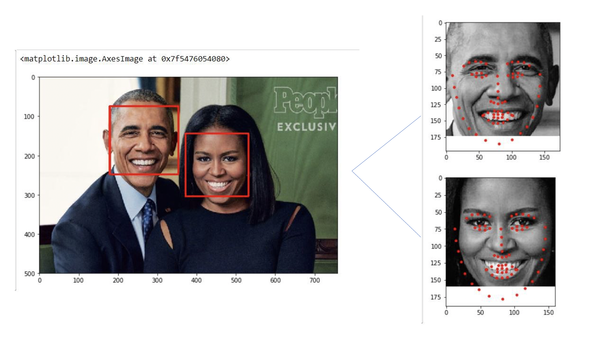

# MicroX_Emotion_Recognition

Approach:

for openface:
only for windows

download this bianary and move core/openface/automation.bat into the OpenFace_2.2.0_win_x64 folder

https://github.com/TadasBaltrusaitis/OpenFace/releases/download/OpenFace_2.2.0/OpenFace_v2.2.0_win_x64.zip

executing the download_models.ps1 PowerShell script(right click on the script and select Run with PowerShell)

replace MYDIR with folder path of images and run the batch script

results will appear in processed/ folder
